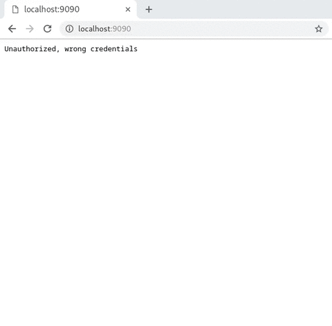

<h1 align="center">:snowflake: coolhttpd :file_folder:</h1>
<div align="center">
  
</div>
<div align="center">
  <strong>Simple HTTP file browser</strong>
</div>
<div align="center">
  A HTTP server with basic authentication, Directory tree view and much more.
</div>
<br/>

<p align="center">
  </img>
</p>

**coolhttpd** is my attempt to solve a part of my workflow

>Everytime I need to copy X thing from *one computer* to *another*, I need to do either of these
> `python -m http.server -p 8080` or `cat file > nc -l 8080`

## :art: Features

+ Simple HTTP File server
+ Supports basic authentication
+ Directory tree view showing every file/folder

And more, see [ToDo](https://github.com/Boot-Error/coolhttpd#clipboard-to-do)

## :hammer: Usage

+ Want to serve current working directoy straight away?
```
$ coolhttpd
```
+ Serve from a specific `host addr` and `port`
```
 $ coolhttpd --host <IP-ADDRESS> --port <PORT>
```
+ Enable Authentication? coolhttpd support basic authentication scheme defined in [RFC 2617](https://tools.ietf.org/html/rfc2617)
```
$ coolhttpd --username <USERNAME> --passwd <PASSWD>
```
+ Serve a specific directory?
```
$ coolhttpd --dir <DIRECTORY TO SERVE>
```

## :floppy_disk: Install

+ Install from source, requires golang toolchain installed on your system.
```
# download the source using go get
$ go get -v github.com/Boot-Error/coolhttpd

# compile the source
$ go install github.com/Boot-Error/coolhttpd

# the compiled binary can be found in $GOPATH/bin, refer Usage
$ $GOPATH/bin/coolhttpd <ARGS>
```

## :clipboard: To-Do

+ Download whole directory as a zip archive
+ Fuzzy Search the serving directory
+ Support for wget's recursive download (still contemplating..)
